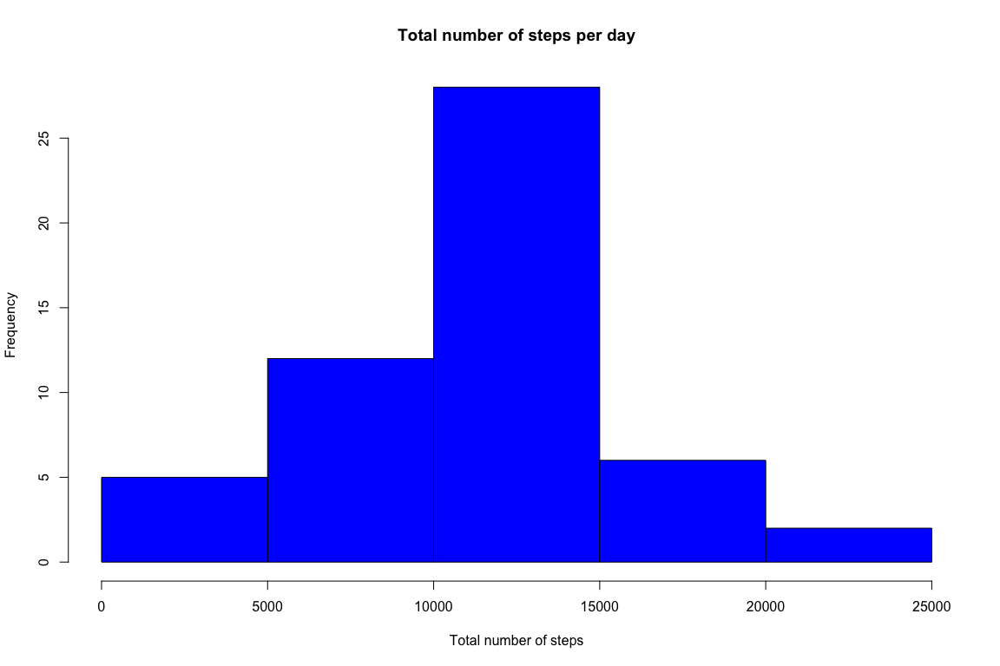
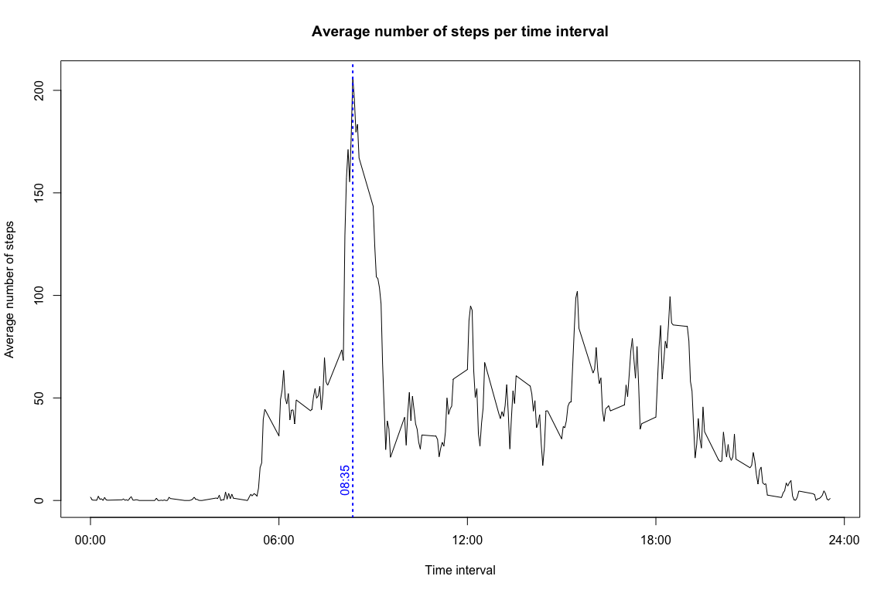
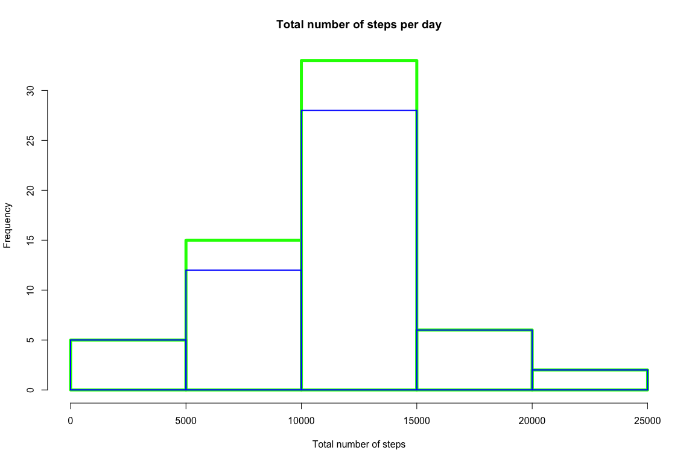
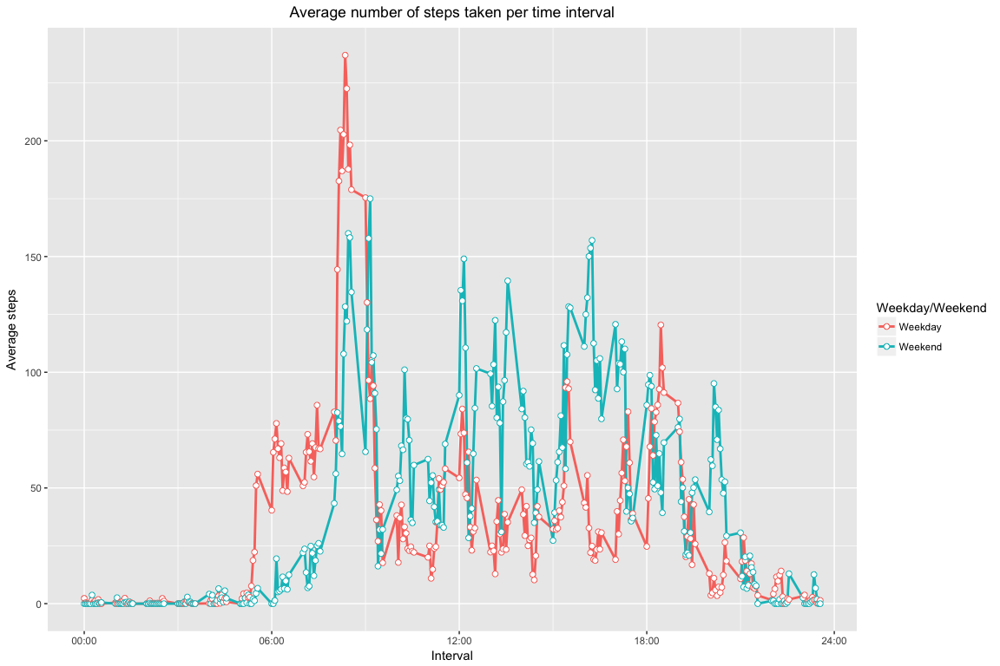
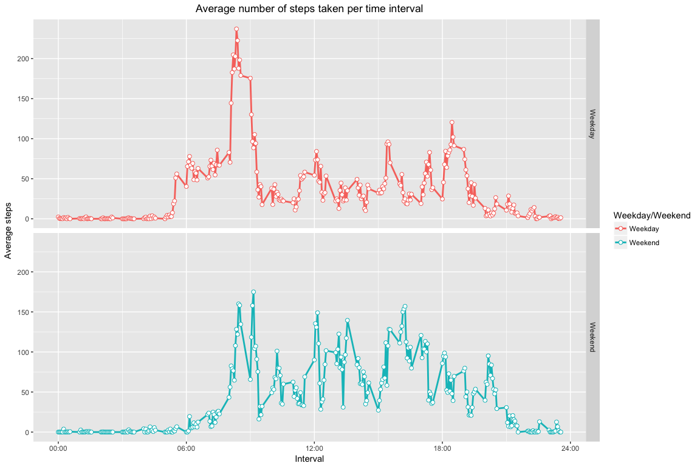

# Reproducible Research: Peer Assessment 1
Alaettin Serhan Mete  
5/3/17  


This file contains information related to the first peer-gradede
assignment in the Reproducible Research course on Coursera.
The goal is to load and analyze the data contained in the forked
repository to answer the questions that are outlined in the assignment.
Of course, the first step is to read the data and prepare it for
processing:

## Loading and preprocessing the data

If the csv file doesn't exist we unzip the data file contained in the
repository to create it. Then read and load it into a dataframe for later use:


```r
#
if(!file.exists("activity.csv")) {
    unzip("activity.zip")
}
#
input.data <- read.csv("activity.csv")
```

Now let's take a quick look to see what's inside:


```r
#
dim(input.data)
```

```
## [1] 17568     3
```

As you can see there are **a total of 17568 observations of a total of
3 variables** that are labelled:


```r
#
names(input.data)
```

```
## [1] "steps"    "date"     "interval"
```

Let's quickly summarize the content as well:


```r
#
summary(input.data)
```

```
##      steps                date          interval     
##  Min.   :  0.00   2012-10-01:  288   Min.   :   0.0  
##  1st Qu.:  0.00   2012-10-02:  288   1st Qu.: 588.8  
##  Median :  0.00   2012-10-03:  288   Median :1177.5  
##  Mean   : 37.38   2012-10-04:  288   Mean   :1177.5  
##  3rd Qu.: 12.00   2012-10-05:  288   3rd Qu.:1766.2  
##  Max.   :806.00   2012-10-06:  288   Max.   :2355.0  
##  NA's   :2304     (Other)   :15840
```

**As you can see, there are a number of NAs (2304) that we should be aware of. 
There are 288 measurement each day with intervals of 5 which tells us that 
the unit of interval is minutes
(since 288 times 5 = 1440 that is the number of minutes in each day).**
Now let's convert the type of date which will be handy later on
(note that the format is "%Y-%m-%d"):


```r
#
input.data$date <- as.Date(input.data$date, format = "%Y-%m-%d")
```

## What is mean total number of steps taken per day?

At this point let's load the dplyr package that has some useful 
tools for us:


```r
#
if(!require(dplyr)) {
    install.packages("dplyr")
    require(dplyr)
}
```

There are a number of ways to do this but we'll use the summarise
function in the dply package to find the total number of steps 
for each day first. While doing this, we'll retain the NAs 
(i.e. if a day has one or more NAs for the number of steps in
any given interval this'll give as an NA for the total number of 
steps):


```r
#
total.steps.data <- input.data %>%
                    group_by(date) %>%
                    summarise(Total.Steps = sum(steps, na.rm = FALSE)) %>%
                    ungroup()

#
head(total.steps.data)
```

```
## # A tibble: 6 × 2
##         date Total.Steps
##       <date>       <int>
## 1 2012-10-01          NA
## 2 2012-10-02         126
## 3 2012-10-03       11352
## 4 2012-10-04       12116
## 5 2012-10-05       13294
## 6 2012-10-06       15420
```

As can be seen, the total number of steps taken first day is NA,
followed by non-NA values. Let's look at the mean and standard
deviation of the total number of steps. Here we'll omit NAs to 
get a sensible result:


```r
#
mean(total.steps.data$Total.Steps, na.rm = TRUE)
```

```
## [1] 10766.19
```

```r
#
median(total.steps.data$Total.Steps, na.rm = TRUE)
```

```
## [1] 10765
```

```r
#
sd(total.steps.data$Total.Steps, na.rm = TRUE)
```

```
## [1] 4269.18
```

We see that the mean of the total number of steps taken each day is 10766,
the median is 10765 while the standard deviation is 4269.
Now, let's make a histogram to see the distribution. 
We'll use R's basic plotting functionality for this one:


```r
#
hist(total.steps.data$Total.Steps,
     main = "Total number of steps per day",
     xlab = "Total number of steps",
     col = "blue")
```

<!-- -->

## What is the average daily activity pattern?

For this one, let's summarize the data as the average (over all days) 
number of steps taken in each time interval:


```r
#
mean.steps.data <- input.data %>%
                   group_by(interval) %>%
                   summarise(Average.Steps = mean(steps, na.rm = TRUE)) %>%
                   ungroup()
#
head(mean.steps.data)
```

```
## # A tibble: 6 × 2
##   interval Average.Steps
##      <int>         <dbl>
## 1        0     1.7169811
## 2        5     0.3396226
## 3       10     0.1320755
## 4       15     0.1509434
## 5       20     0.0754717
## 6       25     2.0943396
```

Now let's plot:


```r
#
plot(mean.steps.data, 
     type = "l",
     main = "Average number of steps per time interval",
     xlab = "Time interval",
     ylab = "Average number of steps",
     xaxt = "n")
#
axis(1, at = seq(0, 2400, by = 600),
     labels = c("00:00","06:00","12:00","18:00","24:00"))
#
abline(v = mean.steps.data$interval[which.max(mean.steps.data$Average.Steps)],
       lty = "dotted", lwd = 2, col = "blue")
#
text(x = mean.steps.data$interval[which.max(mean.steps.data$Average.Steps) - 5],
     y = 10, "08:35", srt = 90, col = "blue")
```

<!-- -->

Let's find the position of the 5 minute interval that has the 
maximum average number of steps, the value of the average number of
step and the associated interval:


```r
#
value <- which.max(mean.steps.data$Average.Steps)
#
print(value)
```

```
## [1] 104
```

```r
#
mean.steps.data$Average.Steps[value]
```

```
## [1] 206.1698
```

```r
#
mean.steps.data$interval[value]
```

```
## [1] 835
```

**So, the 104th 5 minute interval, on average across all the days in the dataset, 
contains the maximum number of steps with 206 steps and corresponds to 08:35 am in the morning. 
This is shown on the plot as the blue verticle line.** 
The plot also shows that the average number of steps is mimimal form midnight 
till 5am in the morning while everyone is sleeping, it is maximized around 8-9am when 
people wake up and presumably go to work (especially in weekdays), 
fluctuates wihtin the day and decreases after 7pm or so.

## Imputing missing values

At the beginning we've seen that there are a total for 2304 missing values in 
our data, let's recall that:


```r
#
summary(input.data)
```

```
##      steps             date               interval     
##  Min.   :  0.00   Min.   :2012-10-01   Min.   :   0.0  
##  1st Qu.:  0.00   1st Qu.:2012-10-16   1st Qu.: 588.8  
##  Median :  0.00   Median :2012-10-31   Median :1177.5  
##  Mean   : 37.38   Mean   :2012-10-31   Mean   :1177.5  
##  3rd Qu.: 12.00   3rd Qu.:2012-11-15   3rd Qu.:1766.2  
##  Max.   :806.00   Max.   :2012-11-30   Max.   :2355.0  
##  NA's   :2304
```

As you can see all the missing data is for the steps column, i.e. there are 
no missing date or interval. For the imputing, we're going to first add a 
fourth column to our dataset where we store the weekday information. Then,
we're going to group our dataset according to *interval* and *day*, and replace
the *steps* with the mean of steps for that given interval and day if the 
value is missing:


```r
#
input.data.imputed <- input.data %>%
                      mutate(day = weekdays(date)) %>%
                      group_by(interval, day) %>%
                      mutate(steps = replace(steps, is.na(steps), mean(steps, na.rm = TRUE))) %>%
                      ungroup()
#
head(input.data.imputed)
```

```
## # A tibble: 6 × 4
##      steps       date interval    day
##      <dbl>     <date>    <int>  <chr>
## 1 1.428571 2012-10-01        0 Monday
## 2 0.000000 2012-10-01        5 Monday
## 3 0.000000 2012-10-01       10 Monday
## 4 0.000000 2012-10-01       15 Monday
## 5 0.000000 2012-10-01       20 Monday
## 6 5.000000 2012-10-01       25 Monday
```

Now let's take a look at the total number of steps taken each day as we
did before but this time using the imputed data:


```r
#
total.steps.data.imputed <- input.data.imputed %>%
                            group_by(date) %>%
                            summarise(Total.Steps = sum(steps, na.rm = FALSE)) %>%
                            ungroup()
#
head(total.steps.data.imputed)
```

```
## # A tibble: 6 × 2
##         date Total.Steps
##       <date>       <dbl>
## 1 2012-10-01    9974.857
## 2 2012-10-02     126.000
## 3 2012-10-03   11352.000
## 4 2012-10-04   12116.000
## 5 2012-10-05   13294.000
## 6 2012-10-06   15420.000
```

```r
#
mean(total.steps.data.imputed$Total.Steps, na.rm = TRUE)
```

```
## [1] 10821.21
```

```r
#
median(total.steps.data.imputed$Total.Steps, na.rm = TRUE)
```

```
## [1] 11015
```

```r
#
sd(total.steps.data.imputed$Total.Steps, na.rm = TRUE)
```

```
## [1] 4014.304
```

**We see that, using the imputed data, the mean of the total number of steps taken each day is 10821, 
the median is 11015 while the standard deviation is 4014. These values used to be 10766,
10765, and 4269, respectively. Although these values change visibly, the overall change is
not drastic. The imputed data has less variablity and larger mean and median as one would
naively expect.** Now let's take a look at the histograms (green imputed, blue original):


```r
#
par(lwd=5)
h1 <- hist(total.steps.data.imputed$Total.Steps,
           main = "Total number of steps per day",
           xlab = "Total number of steps", 
           border = "green")
#
par(lwd=2)
h2 <- hist(total.steps.data$Total.Steps,
           main = "Total number of steps per day",
           xlab = "Total number of steps", 
           border = "blue", 
           add = TRUE)
```

<!-- -->

## Are there differences in activity patterns between weekdays and weekends?

For this one, let's summarize the data as the average (over all days) 
number of steps taken in each time interval using the imputed data and
break it down to weekdays and weekends:


```r
#
mean.steps.data.imputed <- input.data.imputed %>%
                           mutate(day = ifelse(day == "Saturday" | day == "Sunday", "Weekend", "Weekday")) %>%
                           group_by(interval, day) %>%
                           summarise(Average.Steps = mean(steps, na.rm = TRUE)) %>%
                           ungroup()
#
head(mean.steps.data.imputed)
```

```
## # A tibble: 6 × 3
##   interval     day Average.Steps
##      <int>   <chr>         <dbl>
## 1        0 Weekday      2.310714
## 2        0 Weekend      0.000000
## 3        5 Weekday      0.450000
## 4        5 Weekend      0.000000
## 5       10 Weekday      0.175000
## 6       10 Weekend      0.000000
```

Now, let's plot but this time using *ggplot2* package:


```r
#
if(!require(ggplot2)) {
    install.packages("ggplot2")
    require(ggplot2)
}
#
p <- qplot(interval, Average.Steps, data = mean.steps.data.imputed, col = day) 
#
p <- p + geom_line(lwd = 1) + geom_point(size=2, shape=21, fill="white") 
#
p <- p + scale_x_continuous(breaks = seq(0, 2400, by = 600), 
                            labels = c("00:00","06:00","12:00","18:00","24:00"))
#
p <- p + scale_colour_discrete(name = "Weekday/Weekend")
#
p <- p + labs(title = "Average number of steps taken per time interval",
              x = "Interval", y = "Average steps") 
p <- p + theme(plot.title = element_text(hjust = 0.5))
#
print(p)
```

<!-- -->

As can be seen people seem to wake up earlier in the morning during weekdays.
The average number of steps taken starts to increase as early as 5-6am during weekdays,
and only around 7-8am during weekends. Later in the day, after 10am or so, 
there are more steps taken during the weekends than weekdays. This might be 
related to people working in their offices with little activity during weekdays,
whereas people are more active during the weekends.

As a last step, let's remake this last plot as guided in the original template:


```r
#
p <- p + facet_grid(day ~ ., scales="fixed", space="fixed")
#
print(p)
```

<!-- -->

<!-- The part below is completely commented out!!! -->

<!-- 
We can also look at the total number of steps taken and 
break it down to weekends and weekdays. Let's first mutate our previous table,
add an additional column *day* that reads *Weekend* if the weekday is either
Saturday or Sunday, and *Weekday* otherwise. Then make a box plot to visualize
the information and print the medians:
-->


<!-- 
So the median of the total number of steps taken on **weekdays** is **10304**, whereas
this figure is **12130** for the **weekends**. **It looks like people are more active
(i.e. taking more steps at least) during the weekends.**
--> 
